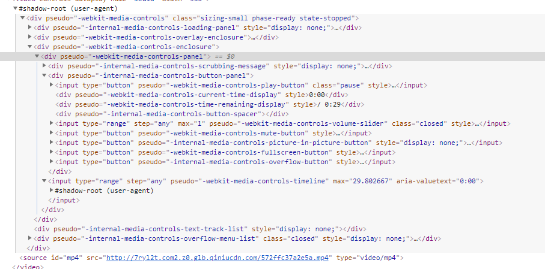

### 什么是 Shadow DOM？
Shadow DOM它允许在文档（document）渲染时插入一棵DOM元素子树，但是这棵子树不在主DOM树中。因此开发者可利用Shadow DOM 封装自己的 HTML 标签、CSS 样式和 JavaScript 代码。

### 什么是shodow root？
以video为例



shadow-root叫做影子根。#shadow-root寄生在video上，所以video被称为影子宿主。可以看到上图有两个#shadow-root，因为#shadow-root可以嵌套，形成节点树，称为影子树（shadow trees）。影子树对其中的内容进行了封装，有选择性的进行渲染。这就意味着我们可以插入文本、重新安排内容、添加样式等等。

### 渲染影子宿主里的内容
content的select属性告诉content标签有选择性的插入内容。select 属性使用 CSS 选择器来选取想要展示的内容，选择器包括类选择器、元素选择器等。
```html
<div class="shadowhost2">
        <span class="shadowhost_content1">写代码</span>
        <span class="shadowhost_content2">拿钱行不行</span>
    </div>
    <!-- S 模板标签 template -->
    <template class="template">
        <h1>
            你
            <content select=".shadowhost_content1"></content>
            我
            <content select=".shadowhost_content2"></content>
            !
        </h1>
    </template>
    <!-- E 模板标签 template -->
    <script>
        var shadowHost = document.querySelector('.shadowhost2');
        var shadowRoot = shadowHost.createShadowRoot();
        var template = document.querySelector('.template');
        // template.content会返回一个文档片段，可以理解为另外一个document。
        // 利用document.importNode获取节点，true表示深度克隆。
        shadowRoot.appendChild(document.importNode(template.content, true));
    </script>
```
### 有两种自定义元素
- Autonomous custom elements 是独立的元素，它不继承其他内建的HTML元素。可以直接写成HTML标签的形式。例如 `<popup-info>`，或者是`document.createElement("popup-info")`；
- Customized built-in elements 继承自基本的HTML元素。创建时必须指定所需扩展的元素， 使用时，需要先写出基本的元素标签，并通过 is 属性指定custom element的名称。例如`<p is="word-count">`, 或者 `document.createElement("p", { is: "word-count" })`；

### 1、 怎样创建自定义元素？
```javascript
class MyElement extends HTMLElement {
        // 构造函数只能用来初始化状态和设置 Shadow DOM
        constructor () {
        	super();
        }
        connectedCallback () {
			console.log('元素被挂载到了body上, 类似于vue的mounted钩子函数');
        }
}
```

### 2、怎样注册一个自定义元素？
```javascript
window.customElements.define('my-element', MyElement);
```

接收三个参数：
        一个 DOMString，用于表示所创建的元素的名称。注意，custom element 的名称中必须要有短横线。
        一个类对象，用于定义元素的行为。
        一个包含 extends属性的配置对象，是可选参数。它指定了所创建的元素继承自哪个内置元素，可以继承任何内置元素。

### 3、生命周期

- connectedCallback：当 custom element首次被插入文档DOM时，被调用。

- disconnectedCallback：当 custom element从文档DOM中删除时，被调用。

- adoptedCallback：当 custom element被移动到新的文档时，被调用。

- attributeChangedCallback: 当 custom element增加、删除、修改自身属性时，被调用。
